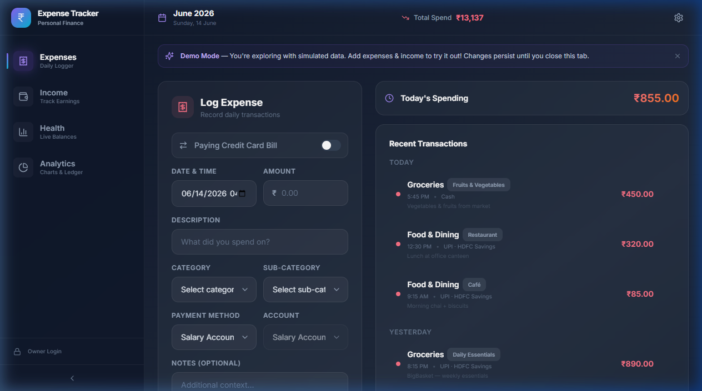
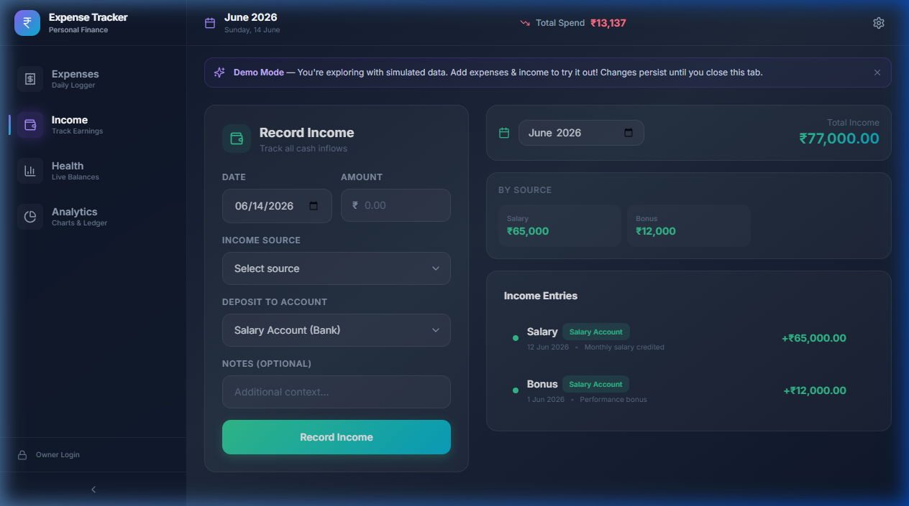
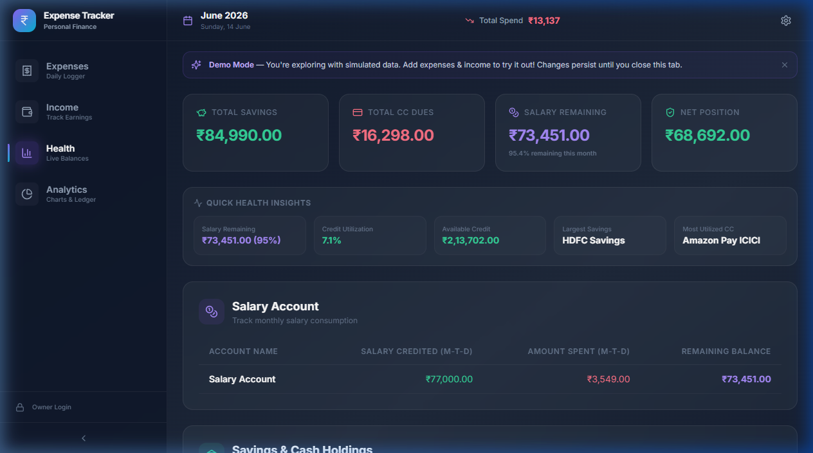
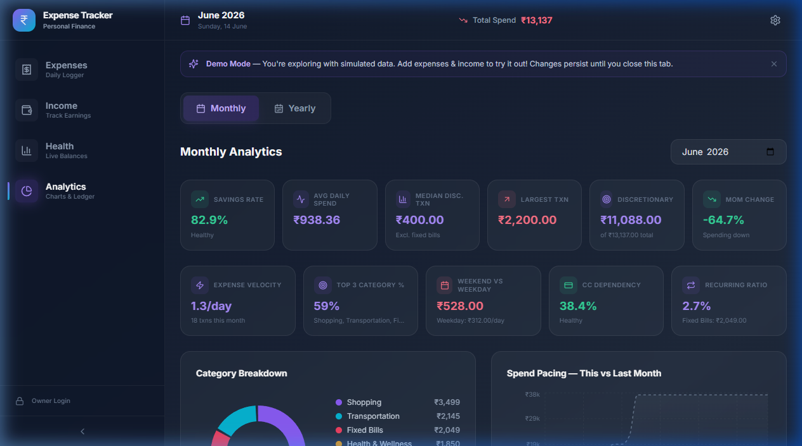

# 💰 Personal Expense Tracker & Financial Intelligence Dashboard

A modern, high-fidelity, use-case-driven financial tracking application. Unlike generic trackers that just list transactions, this application computes real-time liquid balances, credit utilization, cumulative spend pacing, and high-value financial intelligence KPIs (such as savings rates, credit card dependencies, and weekend vs. weekday spending velocity).

Built on top of a highly responsive **React + Vite** frontend, styled with **Tailwind CSS**, and backed by **Supabase (PostgreSQL)** for robust, real-time data persistence.

---

## 🚀 Key Value Propositions & Use Cases

### 🏦 1. Real-Time Net Worth & Liquidity Tracking
* **The Problem:** You have money spread across multiple savings accounts, wallets, and cash, while carrying outstanding balances on multiple credit cards. Calculating your actual net worth manually is tedious and prone to delay.
* **The Solution:** Configure multiple accounts and credit cards with their respective opening balances and limits. Every time you log an income or transaction, the app dynamically routes the cash flow to compute:
  * **Live Bank Balances** (`Opening Balance` + `Income In` - `Expenses Out`).
  * **Outstanding Credit Card Liabilities** (`Opening Dues` + `Card Spend` - `Bill Payments`).
  * **Net Liquidity Position** (`Total Savings Balance` - `Outstanding Card Dues`).
  * **Salary Account Rules:** All income tracking metrics (including Salary Remaining, dashboard charts, and historical summaries) only consider inflows deposited directly into a designated default **Salary Account**. Income deposited into secondary savings accounts updates the account balance but does not inflate your monthly/yearly income aggregates.

### 📈 2. Spend Pacing & Habit Adjusting
* **The Problem:** You want to know if you're spending too fast *during* the month, rather than realizing it after you've already overspent.
* **The Solution:** The **Spend Pacing Cumulative Area Chart** maps your spending day-by-day. It overlays the current month's cumulative pacing against the previous month. If you see the purple line (this month) rising steeper than the gray line (last month) by Day 10, you get an early warning to control your discretionary spending.

### 💳 3. Managing Credit Card Debt & Limits
* **The Problem:** Maxing out credit cards or losing track of your credit utilization ratio can hurt your credit score.
* **The Solution:** The **Credit Cards Matrix** monitors credit card utilization percentages in real time. It features a color-coded indicator (Green ➡️ Amber ➡️ Red) that warns you when a card's utilization goes beyond 50% or 80%.
  * **Customizable Due Days:** Customize the billing due day (1-31) for each credit card individually.
  * **Automatic Paid Status:** Credit card bill payment checkboxes are computed dynamically by scanning for a `Credit Card Payment` category transaction in the current month. The status automatically ticks green when paid, and resets to unpaid at the start of a new month (preventing manual state mismatch).

### 📊 4. Granular Financial Health Indicators
* **The Problem:** Simple expense figures don't tell the whole story of your financial habits.
* **The Solution:** Get access to 11 professional-grade financial metrics calculated on the fly:
  * **Savings Rate:** The percentage of income saved `((Income - Expenses) / Income) * 100`.
  * **Weekend vs. Weekday Spikes:** Spot if your weekend spending habits are significantly higher than weekdays, calculated strictly on discretionary transactions.
  * **Discretionary Spending:** Filters out fixed bills (Rent, Utilities, EMI) to show exactly how much you are spending on "wants".
  * **CC Dependency:** The share of expenses paid with credit cards vs cash/bank transfer.
  * **Category Concentration:** Tracks whether your top 3 categories swallow more than 80% of your budget.

---

## 📱 Application Walkthrough & Screenshots

### 1. Expense Logger (Dashboard)
Log transactions with a split-second workflow. The form dynamically populates the appropriate subcategories and accounts based on your selection.
* **Payment Methods:** Switch between *Cash*, *Bank Transfer* (updates savings account), or *Credit Card* (updates credit card dues).
* **Smart Defaults:** Auto-selects your default salary account as the payment source, and resets safely on form submissions.


### 2. Settings: Managing Accounts & Credit Cards
Accessible directly from the **Gear icon** in the top-right header, this modal is the control center of your tracker.
* **Configure Accounts:** Set up bank accounts or digital wallets with custom opening balances, and designate a default Salary Account.
* **Configure Credit Cards:** Define credit limits, opening dues, and custom billing due day (1-31) for each card.

### 3. Income Logger
Input salaries, bonuses, interest, or debt repayments from friends. 
* **Allowed Sources:** Income sources are strictly categorized as `Salary`, `Bonus`, `Interest`, or `Debt Repayment`.
* **Liquidity Routing:** Direct funds to any of your configured accounts (e.g. savings account) to update its live balance. Only income sent to your default salary account counts towards application-wide income and salary-remaining metrics.


### 4. Financial Health Matrix
A detailed diagnostic board displaying your balance sheets:
* **Savings Matrix:** Real-time logging of opening balance, accumulated income, direct expenses out, and final live balance.
* **Credit Cards Matrix:** Progress bars depicting credit limit usage, opening dues, direct card spend, bill payments made, total owed, and available credit limit. Shows dynamic billing due dates and calculated payment checkmarks.


### 5. Interactive Analytics Panel
* **TopBar Discretionary Spend:** The center header tracks your total monthly discretionary spend (excluding savings transfers, investments, and credit card payments to avoid double counting).
* **Category Breakdown (Donut Chart):** Visualizes expense categories (e.g., Groceries, Food & Dining, Transport, Munchies) with percentage shares and totals.
* **Spend Pacing Chart (Area Chart):** Cumulative monthly spend comparison.
* **Yearly Trends (Line/Bar Charts):** Toggle to the Yearly tab to analyze Mean Daily Spend, Median Transaction size, and Max Transaction peaks over the current financial year (April to March) computed strictly over active months.
* **Ledger Table:** A powerful filterable search ledger with date range selection and categories to locate or delete records.


---

## 🛠️ Technology Stack

* **Frontend Framework:** React 19 (via Vite)
* **Styling:** Tailwind CSS
* **Database & Backend:** Supabase (PostgreSQL)
* **Charts & Visuals:** Recharts
* **Icons:** Lucide React
* **Toast Notifications:** React Hot Toast
* **Routing:** React Router DOM

---

## ⚙️ Installation & Local Setup

Follow these steps to run the project locally on your machine:

### 1. Clone the Repository
```bash
git clone <your-repository-url>
cd Tracker
```

### 2. Install Dependencies
Make sure you have [Node.js](https://nodejs.org/) installed (v18+ recommended), then run:
```bash
npm install
```

### 3. Create Environment Variables File
Copy the example environment file:
```bash
cp .env.example .env
```
Open the `.env` file and replace the placeholder values with your Supabase credentials:
```env
VITE_SUPABASE_URL=https://your-project-id.supabase.co
VITE_SUPABASE_ANON_KEY=your-supabase-anon-key
```

---

## 🗄️ Supabase Database & Tables Setup

To set up your Supabase database from scratch:

1. Log in to your [Supabase Dashboard](https://supabase.com/).
2. Create a new project.
3. Open the **SQL Editor** from the left navigation panel.
4. Create a new query, paste the following SQL script to create all schema tables, and click **Run**:

```sql
-- 1. Create Accounts Table
CREATE TABLE accounts (
    id SERIAL PRIMARY KEY,
    name VARCHAR(255) NOT NULL,
    type VARCHAR(50) NOT NULL,
    opening_balance DECIMAL(12,2) DEFAULT 0.00,
    is_salary_default BOOLEAN DEFAULT false
);

-- 2. Create Credit Cards Table
CREATE TABLE credit_cards (
    id SERIAL PRIMARY KEY,
    name VARCHAR(255) NOT NULL,
    credit_limit DECIMAL(12,2) NOT NULL,
    opening_dues DECIMAL(12,2) DEFAULT 0.00,
    due_day INTEGER DEFAULT 20
);

-- 3. Create Categories Table
CREATE TABLE categories (
    id SERIAL PRIMARY KEY,
    name VARCHAR(255) NOT NULL,
    type VARCHAR(50) NOT NULL
);

-- 4. Create Subcategories Table
CREATE TABLE subcategories (
    id SERIAL PRIMARY KEY,
    category_id INTEGER REFERENCES categories(id),
    name VARCHAR(255) NOT NULL
);

-- 5. Create Income Table
CREATE TABLE income (
    id SERIAL PRIMARY KEY,
    date DATE NOT NULL,
    source VARCHAR(255) NOT NULL,
    amount DECIMAL(12,2) NOT NULL,
    account_id INTEGER REFERENCES accounts(id),
    notes TEXT
);

-- 6. Create Transactions Table
CREATE TABLE transactions (
    id SERIAL PRIMARY KEY,
    date TIMESTAMP NOT NULL,
    category_id INTEGER REFERENCES categories(id),
    subcategory_id INTEGER REFERENCES subcategories(id),
    amount DECIMAL(12,2) NOT NULL,
    payment_method VARCHAR(50) NOT NULL,
    account_id INTEGER REFERENCES accounts(id),
    credit_card_id INTEGER REFERENCES credit_cards(id),
    cc_payment_type VARCHAR(50) DEFAULT NULL,
    notes TEXT
);
```

---

## 🌱 Seeding Categories and Subcategories

The project includes a seeder script (`scripts/seed-categories.js`) to populate the `categories` and `subcategories` tables with predefined items (Fixed Bills, Food & Dining, Transport, Shopping, Entertainment, Groceries, Investments, Munchies, etc.).

To seed your Supabase database:

1. Obtain your Supabase **Service Role Key** from **Project Settings > API**.
2. Run the seed script using one of the following commands:

**Using Node 20.6+ built-in environment loader (Recommended):**
Create a temporary `.env` file (or append it to your `.env`) containing the service key:
```env
SUPABASE_URL=https://your-project-id.supabase.co
SUPABASE_SERVICE_KEY=your-supabase-service-role-key
```
Then run:
```bash
node --env-file=.env scripts/seed-categories.js
```

**Using custom environment variables command line:**
```bash
SUPABASE_URL=your_project_url SUPABASE_SERVICE_KEY=your_service_role_key npm run seed
```

---

## 🚀 Running the Project

To start the Vite development server locally, run:

```bash
npm run dev
```

Open [http://localhost:5173](http://localhost:5173) in your browser to view the application.

### Additional Scripts
* **Build the application for production:**
  ```bash
  npm run build
  ```
* **Preview the production build locally:**
  ```bash
  npm run preview
  ```
