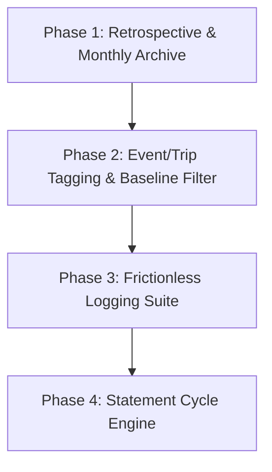

# 🎯 Product Roadmap & Implementation Plan — Finance Tracker v2

## Executive Summary & Vision

The primary goal of this iteration is to transform the application from a **passive expense recorder** into an **intelligent spending visibility & retrospective engine**.

We are tackling the 4 core product flaws:
1. **Analytics Amnesia:** Data resets on the 1st of every month with no historical narrative or closure.
2. **Data Distortion:** Vacation or one-off big purchases pollute monthly living cost baselines.
3. **High Logging Friction:** Too many dropdown clicks for simple daily purchases.
4. **Statement Mismatch:** Credit card tracking strictly follows calendar months instead of actual billing cycles.

---

## 🗺️ Phased Implementation Plan

---

## Phase 1: 📜 Closed-Month Retrospective & Archive Engine

### The Problem
On the 1st of a new month, current month analytics reset to 0. You are greeted with an empty page, and past insights are buried behind manual month pickers.

### The Solution
1. **Automated Month-End Retrospective Cards:** A dedicated **"Reports & Archive"** tab in Analytics that automatically compiles closed months into structured executive summary cards:
   - Total Income vs. Total Outflow
   - Net Liquidity Delta (+/-)
   - Discretionary vs. Fixed Bills breakdown
   - Top 3 Cash Drains & Largest single transaction
   - MoM Variance Badge (🟢 spend down / 🔴 spend up vs prior month)
2. **Zero-Data Fallback:** When the current month has < 3 transactions, Analytics automatically defaults to showing the most recently closed month's retrospective report instead of an empty screen.

### Technical Approach
- Add a 3rd tab (`Reports & Archive`) to [Analytics.jsx](file:///d:/Self-Learning/Tracker/src/pages/Analytics.jsx).
- Build a `RetrospectiveReportCard` component that renders past months using `computeMonthStats()`.
- Add a side-by-side comparison modal to select any 2 past months and compare category-by-category variances.

### Files Affected
- [Analytics.jsx](file:///d:/Self-Learning/Tracker/src/pages/Analytics.jsx) — Add `Reports & Archive` tab and retrospective rendering
- [stats.js](file:///d:/Self-Learning/Tracker/src/utils/stats.js) — Add month-range aggregation helper

---

## Phase 2: 🏷️ Event / Trip Wrappers & Baseline Filtering

### The Problem
A 4-day trip or a laptop purchase spikes your "Food & Dining" or "Shopping" category for that month, permanently skewing your MoM trends and baseline living cost calculations.

### The Solution
1. **Event Tagging System:** Allow wrapping transactions with an optional Event/Trip tag (e.g. `#GoaTrip2026`, `#DiwaliShopping`, `#HomeRenovation`).
2. **Baseline Spending Filter:** A global toggle on Analytics: `[x] Exclude Special Events`. When active, all charts and KPIs recalculate strictly over your **routine cost of living**.
3. **Event Deep-Dive Drawer:** Clicking any event tag opens a dedicated view showing total cost, category breakdown, and payment method split for that specific event.

### Technical Approach
- Update database schema / JSON schema for transactions to store an optional `event_tag` text field.
- Add an Event Tag selector / free-text input to [ExpenseForm.jsx](file:///d:/Self-Learning/Tracker/src/components/forms/ExpenseForm.jsx).
- Update `computeMonthStats()` in [stats.js](file:///d:/Self-Learning/Tracker/src/utils/stats.js) to accept an optional `excludeEvents` flag.

### Files Affected
- Schema / Supabase `transactions` table — Add `event_tag` column
- [ExpenseForm.jsx](file:///d:/Self-Learning/Tracker/src/components/forms/ExpenseForm.jsx) — Add Event Tag input
- [Analytics.jsx](file:///d:/Self-Learning/Tracker/src/pages/Analytics.jsx) — Add Baseline Toggle & Event breakdown

---

## Phase 3: ⚡ Frictionless Logging Suite

### The Problem
Logging an expense requires 5 dropdown clicks and form navigation. Mistyping an amount requires deleting and re-logging from scratch.

### The Solution
1. **Quick Repeat Button (↻):** One-click on any recent transaction populates the form with Category, Subcategory, Payment Method, and Account (clearing amount & setting date to NOW).
2. **Inline Edit:** Clicking any transaction in the list opens it in the logger pre-filled, switching submit to "Update Transaction".
3. **Smart Quick Log Input Bar:** A single text input at the top of the Expense Logger:
   > Example: `450 swiggy lunch cc icici`
   - Auto-selects Amount: ₹450, Category: Food & Dining, Subcategory: Lunch, Method: Credit Card (ICICI).

### Technical Approach
- Add prefill and edit state handlers in [ExpenseLogger.jsx](file:///d:/Self-Learning/Tracker/src/pages/ExpenseLogger.jsx) and [ExpenseForm.jsx](file:///d:/Self-Learning/Tracker/src/components/forms/ExpenseForm.jsx).
- Implement a lightweight regex/keyword matcher in `src/utils/parser.js` for the Smart Quick Input bar.

### Files Affected
- [ExpenseLogger.jsx](file:///d:/Self-Learning/Tracker/src/pages/ExpenseLogger.jsx)
- [ExpenseForm.jsx](file:///d:/Self-Learning/Tracker/src/components/forms/ExpenseForm.jsx)
- [NEW] [parser.js](file:///d:/Self-Learning/Tracker/src/utils/parser.js) — Natural language input parser

---

## Phase 4: 💳 Credit Card Statement Cycle & Forecast Engine

### The Problem
Credit card billing cycles (e.g. 15th to 14th) never align with calendar months (1st to 30th). Measuring card dues by calendar month leads to payment surprises.

### The Solution
1. **Billing Cycle Configuration:** Set custom statement billing dates per credit card (e.g. Statement Date: 15th, Due Date: 5th of next month).
2. **Live Statement Forecast Bar:** Shows current unbilled statement total vs. projected statement total based on daily spending velocity.
3. **Payment Countdown Matrix:** Enhanced Financial Health matrix with exact days remaining until statement generation and due dates.

### Technical Approach
- Update `credit_cards` schema to store `statement_day` alongside `due_day`.
- Refactor `getBillingCycle()` in [FinancialHealth.jsx](file:///d:/Self-Learning/Tracker/src/pages/FinancialHealth.jsx) to calculate exact unbilled vs. billed cycle totals.

### Files Affected
- [FinancialHealth.jsx](file:///d:/Self-Learning/Tracker/src/pages/FinancialHealth.jsx)
- [CreditCardForm.jsx](file:///d:/Self-Learning/Tracker/src/components/forms/CreditCardForm.jsx)

---

## 🧪 Verification Plan

### Automated Verification
- Run `npm run build` after completing each phase to verify zero syntax/type errors.

### Manual Verification
1. **Phase 1 (Archive):** Verify retrospective cards load cleanly for past months and zero-data state defaults to last month's report.
2. **Phase 2 (Event Tags):** Tag 3 transactions with `#Trip`, toggle `Exclude Special Events`, verify Analytics KPIs exclude those transactions.
3. **Phase 3 (Quick Logging):** Test Quick Repeat, Inline Edit, and text parsing (`450 swiggy`).
4. **Phase 4 (Statement Engine):** Verify unbilled card totals match transactions between statement dates.

---

> [!IMPORTANT]
> **User Review Required:** Review this updated roadmap. Once approved, we will begin execution starting with **Phase 1 (Closed-Month Retrospective & Archive Engine)**.
